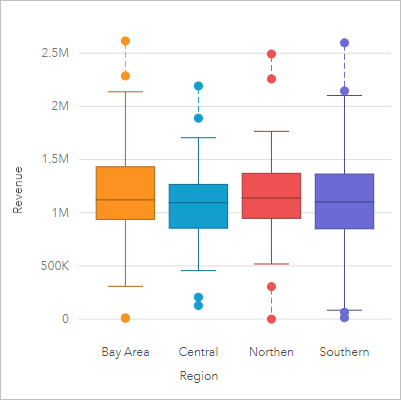
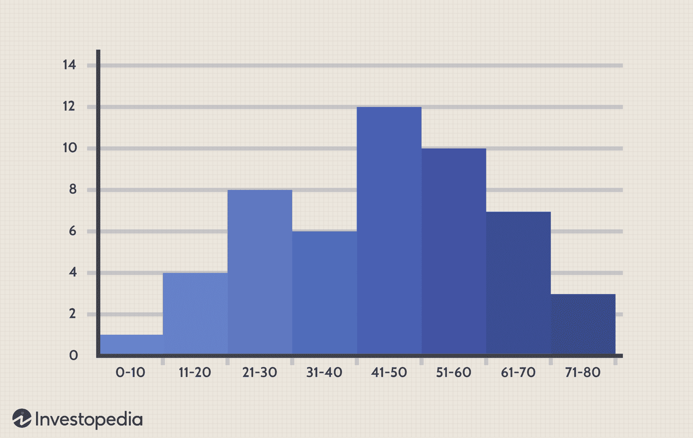
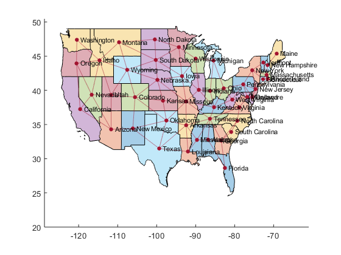
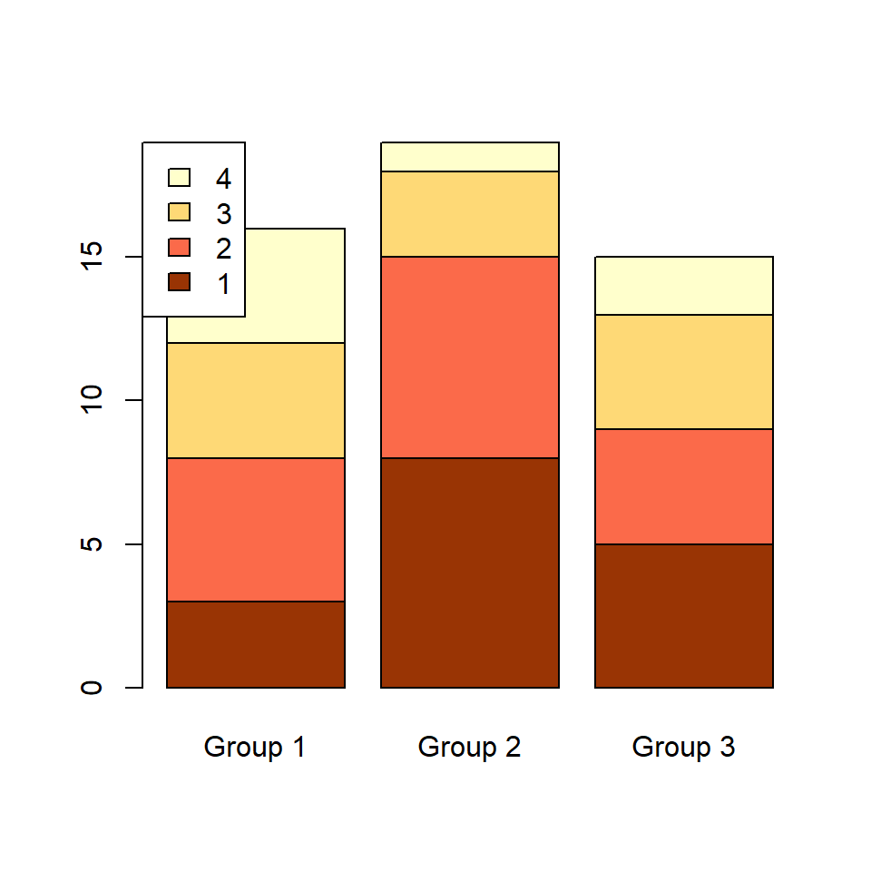

# DATA Visualization

> Following are some important  points in Data Visualization

 - Data Points
  - Board(Canvas)
 - Axis
  - Text
  - Information
  
  ## Bar Plot

  ## Box Plot
  

  ## Histogram
  

  ## Line Plot
  

  ## Maps
  

  ## Normal Plots
  

  ## Pair Plots
  

  ## Pie Chart
  

  ## Scatter Plot
  

  ## Stacked Bar Plot
  

**Note:**  There are tickmarks on the axis to show the data.